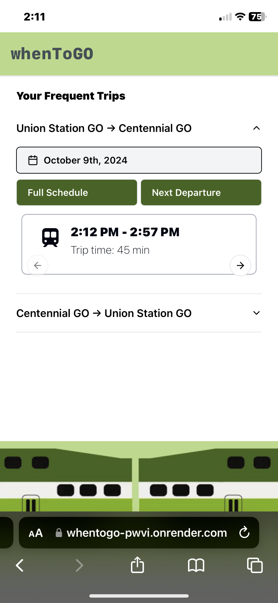

## whenToGO | https://whentogo-pwvi.onrender.com

---

<!-- TABLE OF CONTENTS -->

  
Table of Contents

  <ol>
    <li>
      <a href="#about-the-project">About The Project</a>
      <ul>
        <li><a href="#motivation">Motivation</a></li>
        <li><a href="#built-with">Built With</a></li>
      </ul>
    </li>
    <li><a href="#usage">Usage</a></li>
    <li><a href="#roadmap-future-additions">Roadmap</a></li>
  </ol>

<!-- ABOUT THE PROJECT -->

### About The Project

<!-- ![Product Name Screen Shot][product-screenshot] -->

whenToGO is a web application that allows users to save their frequent GO bus/train trips and easily access them to see arrival and departure times. Users will also have the option to see when they should leave their current location to arrive on time to the departure station.

This web app is designed for frequent riders with irregulars schedules that can benefit from quickly checking when their next bus/train arrives.

#### Motivation

I noticed that I was going to the GO website a lot to check service schedules and it felt very tedious having to choose the stations every time. I thought it would be nice being able to save frequent trips and access them right away.

This would also be a good opportunity to work with external APIs such as GO API and Google Maps API. Additionally, it was cool working with Tailwind and building a responsive interface.

### Built With

[![React][React.js]][React-url]
[![Tailwind CSS][Tailwindcss]][Tailwindcss-url]
[![Typescript][Typescript]][Typescript-url]
[![Node][Node.js]][Node-url]
[![Express][Express.js]][Express-url]

<!-- USAGE EXAMPLES -->

### Usage

Below are screenshots of how a user can save a frequent trip and access it

<!-- ROADMAP -->

### Roadmap (Future Additions)

- [ ] Toggle time formats
- [ ] Add dark mode
- [ ] Integrate with Google Maps API to calculate departure time for users

<!-- MARKDOWN LINKS & IMAGES -->
<!-- https://www.markdownguide.org/basic-syntax/#reference-style-links -->

[product-screenshot]: images/product-screenshot.png
[Tailwindcss]: https://img.shields.io/badge/Tailwind_CSS-grey?style=for-the-badge&logo=tailwind-css&logoColor=38B2AC
[Tailwindcss-url]: https://tailwindcss.com/
[React.js]: https://img.shields.io/badge/React-20232A?style=for-the-badge&logo=react&logoColor=61DAFB
[React-url]: https://reactjs.org/
[Node.js]: https://img.shields.io/badge/node.js-339933?style=for-the-badge&logo=Node.js&logoColor=white
[Node-url]: https://nodejs.org/en
[Express.js]: https://img.shields.io/badge/Express%20js-000000?style=for-the-badge&logo=express&logoColor=white
[Express-url]: https://expressjs.com/
[Typescript]: https://img.shields.io/badge/TypeScript-3178C6?style=for-the-badge&logo=typescript&logoColor=white
[Typescript-url]: https://www.typescriptlang.org/
